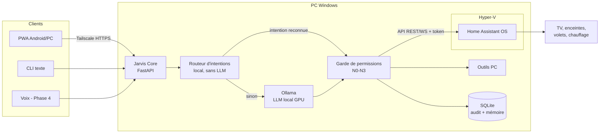

# JARVIS — Architecture (Phase 0)

Statut : **validée** par le propriétaire et l'Expert Sécurité le 2026-10-07.

## 1. Contraintes issues du cadrage

| Donnée | Valeur | Conséquence |
|---|---|---|
| PC | Windows 11 Pro, i5-14600KF, 32 Go RAM, RTX 5070 Ti 16 Go | Assez puissant pour faire tourner un LLM et Whisper en local |
| Serveur 24 h/24 | Aucun : tout tourne sur le PC | Jarvis et la domotique sont indisponibles quand le PC est éteint |
| Smartphone | Android | Une PWA installable suffit (pas de store, pas de Mac) |
| Appareils | TV Google TV, 2 clims réversibles, volets roulants | Intégrations Home Assistant en Phase 2 (§3.4) |
| Budget IA | **0 €** | Aucun appel d'API payante : LLM local via Ollama |

Tout ce qui est retenu est gratuit et open source, ou gratuit pour un usage personnel (Tailscale).

## 2. Vue d'ensemble



## 3. Composants

### 3.1 Jarvis Core : Python 3.12 + FastAPI
Python est déjà installé, et tout l'écosystème utile est en Python : Ollama, faster-whisper, Piper, le client Home Assistant et les API Windows (pywin32, pycaw).

**Écart par rapport au prompt maître, à valider :** le Core et l'Agent PC forment **un seul processus** au départ, découpé en modules (`jarvis/core`, `jarvis/tools/pc`). Pourquoi :
- le serveur est le PC lui-même, donc une API locale de plus ajouterait un saut réseau sans gain de sécurité ;
- sous Windows, un service « droits élevés » tourne en session 0 et **ne peut pas** toucher au bureau de l'utilisateur (applis, volume, presse-papiers, captures). Le process doit donc tourner dans la session utilisateur, avec les droits normaux. Les rares actions admin (installer un logiciel) passent par l'invite UAC, qui sert aussi de confirmation N2.

Tous les outils respectent la même interface (`Tool` : nom, description, schéma des paramètres, niveau, fonction). Si un serveur dédié (un Raspberry Pi) arrive plus tard, les outils PC pourront sortir dans un agent séparé sans rien réécrire.

### 3.2 Routeur d'intentions (objectif < 1 s)
1. Normalisation (minuscules, accents, mot « Jarvis » retiré).
2. Correspondance avec un catalogue de motifs en YAML (« allume|éteins (le|la)? {pièce} », « mets la TV sur {chaîne} », « volume {n} »…) et fuzzy matching via `difflib` (bibliothèque standard).
3. Intention reconnue : appel direct de l'outil, en ~50 à 200 ms.
4. Sinon, la demande part au LLM local avec la liste des outils (tool calling).

### 3.3 LLM local : Ollama
- Modèle open-weight de 8 à 14 milliards de paramètres, quantifié en Q4, qui sait appeler des outils et parle bien français. Il occupe 6 à 10 Go de VRAM. Le choix final se fait **par benchmark en Phase 1** sur un jeu de 30 commandes réelles ; les candidats sont les familles Qwen3 et Mistral Small.
- `keep_alive` réglable : le modèle reste chargé pour la réactivité, ou se décharge pour libérer le GPU (pour jouer, par exemple).
- Le rôle du Contrôleur de tokens devient : taille du contexte, nombre d'outils exposés par requête, latence et VRAM.

### 3.4 Domotique : Home Assistant OS dans une VM Hyper-V
- C'est la méthode officiellement supportée sous Windows (Docker Desktop sous Windows ne gère pas le réseau `host` qu'exige la découverte des appareils).
- La VM est en réseau ponté, donc HA a sa propre IP sur le réseau local.
- Jarvis parle à HA uniquement via son API REST et WebSocket, avec un token longue durée rangé dans le keyring Windows.
- **Risque accepté :** PC éteint = plus de domotique pilotée par Jarvis. Les plannings de chauffage restent donc **dans les clims** (minuterie ou appli MELCloud), jamais seulement dans HA.

| Appareil | Intégration HA | Local ? | Matériel en plus |
|---|---|---|---|
| TV Continental Edison (Google TV) | Android TV Remote + Google Cast | oui | aucun |
| 2 clims Mitsubishi MSZ-HR25VFK2 | MELCloud (officielle) | non, cloud Mitsubishi | aucun si le Wi-Fi est déjà configuré |
| idem, option locale | ESPHome sur le connecteur CN105 | oui | un ESP32 par clim (~15 €), ouverture de l'unité intérieure |
| Barre de son Samsung HW-S50B | via la TV (HDMI ARC/CEC) ; SmartThings en option, compatibilité non garantie | oui (via la TV) | aucun |
| Volets Turol Industries (filaires, interrupteur mural double) | Shelly (module « 2PM » en mode volet, derrière l'interrupteur existant, qui reste fonctionnel) | oui, Wi-Fi local, cloud Shelly désactivé | un module par volet (~30 €), neutre requis dans la boîte, pose en 230 V |
| Bbox Wi-Fi 7 XT | aucune nécessaire | — | aucun (Tailscale n'ouvre aucun port) |

### 3.5 Applications : une PWA d'abord
**Écart à valider :** au lieu de Tauri + React Native (deux apps, Rust à installer, deux bases de code), le Core sert **une seule PWA** responsive :
- installable sur Android (écran d'accueil, plein écran) et sur PC (Edge/Chrome) ;
- notifications Web Push, et biométrie Android via **WebAuthn** (empreinte) pour le N3 ;
- un seul design system, par construction.

L'icône de la zone de notification Windows et le raccourci clavier global sont gérés par le programme JARVIS lui-même (il ouvre la fenêtre de la PWA) : Tauri n'est pas nécessaire.

### 3.6 Accès à distance : Tailscale
- Offre gratuite pour un usage personnel, et **aucun port ouvert** sur la box.
- Le Core écoute sur `127.0.0.1` et derrière `tailscale serve` (HTTPS avec un certificat `*.ts.net`, nécessaire pour la PWA, WebAuthn et Web Push).
- Les ACL Tailscale limitent l'accès au Core à tes seuls appareils.

### 3.7 Mémoire et journal d'audit : SQLite
- `audit` : id, horodatage, source (cli/pwa/voix), appareil, outil, paramètres, niveau, décision (auto / confirmé / refusé), résultat. Table en ajout seul : le code ne fait jamais d'`UPDATE` ni de `DELETE`.
- `memory` : préférences et routines, en clé/valeur. La recherche vectorielle (`sqlite-vec`) ne sera ajoutée que si un vrai besoin de rappel sémantique apparaît (YAGNI).
- Sauvegarde : copie quotidienne du fichier `.db` (Phase 5).

### 3.8 Voix (Phase 4), 100 % locale
- Mot de réveil : openWakeWord. Le modèle « hey jarvis » existe tout prêt ; « Jarvis » seul demandera un entraînement maison.
- Reconnaissance vocale : faster-whisper sur le GPU.
- Synthèse vocale : Piper, avec une voix française.

## 4. Sécurité : le modèle de permissions appliqué dans le code

1. **La garde est du code, pas du prompt.** Le LLM *propose* un appel d'outil ; `permissions.py` décide. Aucune phrase du LLM ne peut contourner un niveau.
2. N0/N1 : exécution automatique. N2 : confirmation explicite du propriétaire sur un canal authentifié (PWA, CLI, voix). N3 : confirmation + WebAuthn (biométrie) ou PIN.
3. **Contenu externe = donnée.** Les résultats d'outils (pages web, fichiers, noms d'appareils HA) sont injectés dans le contexte entre balises `<data>`, marqués non fiables. Toute action N2/N3 proposée dans un tour où du contenu externe a été lu exige une confirmation, quel que soit le réglage.
4. Les niveaux sont réglables par outil, mais **baisser un niveau est lui-même une action N3**.
5. Authentification : un token par appareil (stocké dans le keyring côté PC, enrôlement par QR code), révocable, en plus de l'identité Tailscale.
6. Secrets : keyring Windows (`keyring`), `.env` pour la config non secrète, `.env.example` versionné. Rien de sensible dans ce dépôt **public**.
7. Pas de shell arbitraire en N1/N2 : `run_script` n'exécute que les scripts d'un dossier en liste blanche (N2) ; une commande libre est N3.

### Avis de l'Expert Sécurité
**Feu vert pour la Phase 1, sous conditions :**
- la garde de permissions et le journal d'audit sont livrés **avant** tout outil N2 ;
- chaque outil a un test « permission refusée » ;
- la Phase 1 reste locale (`127.0.0.1`) ; l'exposition via Tailscale attend l'authentification par appareil (début de la Phase 3) ;
- l'arrêt ou la mise en veille du PC coupe Jarvis et HA : ces outils sont N2 et le message de confirmation le signale.

## 5. Arborescence du dépôt

```
myJarvis/
├─ CLAUDE.md
├─ pyproject.toml
├─ .env.example
├─ docs/            ARCHITECTURE.md, ROADMAP.md, TOOLS.md
├─ jarvis/
│  ├─ core/         api.py, router.py, llm.py, permissions.py, audit.py
│  ├─ intents.yaml  catalogue du routeur
│  └─ tools/
│     ├─ pc/        outils Windows
│     └─ home/      outils Home Assistant (Phase 2)
├─ web/             PWA (Phase 3)
└─ tests/
```

## 6. Décisions validées par le propriétaire (2026-10-07)

1. Core et Agent PC fusionnés dans un seul processus en session utilisateur (§3.1).
2. Une PWA au lieu de Tauri + React Native (§3.5).
3. Home Assistant OS dans Hyper-V, en acceptant qu'il s'arrête avec le PC (§3.4).
4. LLM 100 % local via Ollama, sans API payante (§3.3).
5. Risque accepté : journal d'audit chaîné par SHA-256 sans HMAC. La clé serait lisible par tout processus du compte, donc inutile contre un attaquant local ; la chaîne détecte les erreurs, l'ancre externe (Phase 5) apportera la garantie (docs/SECURITY_REVIEW_PHASE_1.md, C1).
